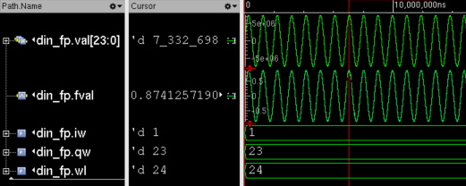

# fplib

## Intro

fplib is a synthesizable SystemVerilog library for working with fixed-point (FP) numbers. This library abstracts out the error-prone task of working with FP numbers, such as keeping track of the integer and fractional bits (the binary point) when doing add/multiply operations. 

fplib lets you effortlessly: 

- perform add, subtract, or multiply operations
- change the number of int/frac bits ('resize') to increase or decrease the range/resolution (clipping if necessary)
- convert float constants (e.g. FIR/IIR filter coefficients) to FP
- access the float representation of FP numbers in simulations 

fplib works by (ab)using SystemVerilog interfaces to encapsulate a normal `logic` vector as well as the parameters for the number of int/frac bits into [a single object](./rtl/fp_if.sv) which can be passed through modules (in the absence of proper language support like [in VHDL](https://github.com/FPHDL/fphdl)). An effort is made to minimize the usage of macros while still keeping the syntax as clean as possible within the (many) limitations of the SV language. In RTL simulations, the interface also holds a float (`real`) representation of the FP number, which is a significant time-saver when using the waveform viewer during debug / DV. 

The target users are ASIC/FPGA designers developing DSP (digital signal processing) circuits in SystemVerilog, such as optimized datapaths with custom word-length adders and multipliers. The usage of this library promotes more generic and parameterizable designs with fewer bugs and much more readable code.

## Motivation

Suppose we needed to design the datapath for a generic linear interpolation module, i.e. y = m*x + b, where y, m, x, and b are fixed point numbers with arbitrary int/frac widths. This is also known as an FMAC (fused MAC) operation.

A standard implementation of such a module and the instantiation of it would look like [interp_no_fplib.sv](./examples/interp_no_fplib.sv). The module is over 20 lines of error-prone code, where all we wanted to do was a multiply and add. If we did not parametrize all the widths we would not need as many lines of code, but that would come at the expense of losing reusability and even less code readability.

With fplib, the same functionality is obtained with essentially 3 lines of code:

```SystemVerilog
sfp #(`mult_iw(m, x), `mult_qw(m, x)) prod(); // declare intermediate signal
sfp_mult_full mult (m, x, prod); // do prod = m * x with full precision
sfp_add add (prod, b, y); // do the add prod + b then resize to fit in y
```
See [interp_fplib.sv](./examples/interp_fplib.sv) for the full code with comments.

## Licensing and Contributions

This project is provided under the terms of the Apache V2.0 license, which allows for commercial, closed-source use. See the LICENSE file for more info. 

Please file an issue to report any bugs. Pull requests are very welcome. Potential areas of improvement include:

- Expand the list of operations, e.g. right/left shift (divide/mult by powers of 2), three operand add/mult/sub
- Add an option for rounding instead of truncating LSBs (floor)
- Improve array support (e.g. add/mult/sub/resize for sfp_arr / ufp_arr)
- Improve test bench (check clipping bit)
- Check compatibility with other vendor tools (Synopsys, etc.)

## Tool Support  

This library has been specifically tested with the following simulation tools:
- Cadence Xcelium 23.03 and 24.09

As well as the following backend tools:
- Cadence Genus 21.18 (ASIC synthesis)
- AMD / Xilinx Vivado 2024.1 (FPGA synthesis)

Other commercial tools are likely to work, but Verilator does not support fplib due to [this long-standing issue](https://github.com/verilator/verilator/issues/1593).

## Integration Guide

- To use this library, it is usually sufficient to pass the file list [fplib.f](./rtl/fplib.f) to the tool with `-F ./rtl/fplib.f`.

- For Cadence Xcelium (simulator), you might need to pass the flag `-vlogcontrolrelax NOTDOT` depending on the version and other flags used.

- For Cadence Genus (synthesis), the usage of `creal_to_sfp` and `creal_to_ufp` modules requires this tcl command during setup to enable parsing of `real` constants: `set_db hdl_enable_real_support true`.

## Reference Guide

For a detailed reference of the modules contained in this library see [the HTML documentation](https://skyworkssolutionsinc.github.io/fplib/).
For a quick start guide that touches on most of the functionality, see below.

## Overview of Fixed-point Representation
A good tutorial on fixed point arithmetic can be found [here](https://onlinelibrary.wiley.com/doi/pdf/10.1002/9781119025498.app2).
In short, a fixed point binary number dedicates a fixed portion of the word length to represent the integer part of the number, and the rest of the bits are used to represent the fractional part. The "binary point" separates the integer and fractional bits.

The [Q format](https://en.wikipedia.org/wiki/Q_(number_format)) is often used to specify the integer width (abbreviated here as `iw`) and the fractional width (`qw`). They add up to `wl`, the total word length of the binary number.

In the convention used in fplib, we count the signed bit in `iw`, for instance:

- A 's1.23' is a signed 24 bit number with `iw = 1` integer bits (the sign bit) and `qw = 23` fractional bits, and can represent numbers from -1.0 to almost 1.0 with 2^-23 resolution
- A 'u4.12' is an unsigned 16 bit number with 6 integer and 10 fractional bits, and can represent numbers from 0 to almost 16 with 2^-12 resolution.
- A 's-2.10' is a signed 8 bit number with 10 fractional bits. A negative `iw` is somewhat uncommon but allows for efficiently representing very small numbers, in this case numbers from -0.125 to almost 0.125 with 2^-10 resolution. This library supports negative `iw` but not negative `qw` (theoretically possible, but very rarely used).

Fixed point representation often results in much more efficient hardware (lower power/area) than using float representations such as IEEE 754 but requires careful management of the binary point, which is a common source of bugs. For example:

- Adding a sA.B to a sC.D number requires aligning the binary point by left shifting the number with the smaller `qw` until both have the same `qw = max(B, D)`, then performing the addition and storing it in a `iw = max(A, C) + 1` and `qw = max(B, D)` number.
- Multiplying a sA.B with a sC.D number does not require pre-shifting, but the binary point shifts after the mult, so the output should be interpreted as a `iw = A + C` and `qw = B + D` number.

## Quick Start Guide

### Define FP signals

Define a `ufp` (unsigned FP) and a `sfp` (signed FP) signal, which are actually SV interfaces parameterized with the desired `iw` and `qw`:

```SystemVerilog
sfp #(1, 23) x();  // x = signed 1.23 (24 bits)
ufp #(4, 12) y();  // y = unsigned 4.12 (16 bits)
```

or more verbosely:

```SystemVerilog
sfp #(.iw(-2), .qw(10)) data(); // data = signed -2.10 (8 bits)
```

Assign an integer to `val` inside `y`, which is the vector that actually holds the data:

```SystemVerilog
assign y.val = 16'd2342; // val is defined as "logic [15:0] val"
```

### Convert floats to FP

Round a `real` parameter (constant) to fit in a s1.23 and assign it to `x.val` using the `creal_to_sfp` module:

```SystemVerilog
parameter real my_float = 0.84234;
creal_to_sfp #(my_float) inst (x);  // same as creal_to_sfp #(.float(0.84234)) inst (.fp(x));
```
If we had passed a number outside the range of a s1.23 (e.g. 2.0), an `$error()` would have been thrown. There is also a `creal_to_ufp` module for unsigned numbers.
  
In test bench code, you can round a `real` variable to an `sfp` or `ufp`:

```SystemVerilog
real my_float;
assign my_float = 0.84234;
real_to_sfp inst (my_float, x);
```

`real_to_sfp` and `real_to_ufp` are not synthesizable.

### Read back as float  

The float representation of the fixed point number is held in `fval` (a `real`) for easier debug/DV. 

In RTL simulations (but not gate-level sims), `fval` can be accessed in test benches and visualized in the waveform viewer. If there are any X or Z bits in `val`, `fval` is set to float NaN.

In the screenshot below from Cadence SimVision showing an `sfp`, `fval = 0.8741` is the float representation of the 24-bit logic vector `val = 7,332,698` in signed Q1.23 format:



### Resize (change `iw` or `qw`)

Resize x from a s1.23 to a lower resolution s1.15:

```SystemVerilog
sfp #(1, 15) x_less_res();
sfp_resize inst (x, x_less_res);
```
Note that if `qw` is being decreased, `sfp_resize`/`ufp_resize` truncate LSBs, which is equivalent to a floor to -inf. If `qw` is being increased, zeros are padded at the LSB.

If `iw` is being decreased (reducing the range), `*fp_resize` simply drops MSBs, i.e. the number may wrap.

Resize x to a s0.23 by saturating (clipping) instead by using `*fp_resize_ind`:

```SystemVerilog
sfp #(0, 23) x_less_hr();
wire clipping;
sfp_resize_ind inst (.in(x), .out(x_low_res), .clipping(clipped));
```
The `clipping` indicator goes high when `x` is being clipped to the max/min value that can fit in a s0.23.

if `iw` is being increased, `*fp_resize` and `*fp_resize_ind` pad zeros at the MSB position (`ufp`), or sign-extend (`sfp`).

### Convert between `ufp` and `fp`

Convert from unsigned to signed and resize to the desired format with `ufp_to_sfp` and `sfp_to_ufp`. For example, make an unsigned number signed by adding a zero sign bit and drop an LSB to reduce resolution in one go with:

```SystemVerilog
sfp #(`fp_iw(y) + 1, `fp_qw(y) - 1) yy(); // iw+1 for the sign bit, qw-1 for less resolution
ufp_to_sfp inst (y, yy); // unsigned 4.12 to signed 5.11
```

The macros `fp_iw(fp)`, `fp_qw(fp)` and `fp_wl(fp)` provide elaboration time access to the integer width, fractional width, and total word length of sfp/ufp signals.

`ufp_to_sfp` and `sfp_to_ufp` drop MSBs, so the output may wrap. To clip instead, use `sfp_to_ufp_ind` and `sfp_to_ufp_ind`. For example, make a signed number unsigned by clipping negative numbers to zero and dropping the sign bit:

```SystemVerilog
ufp #(`fp_iw(x) - 1, `fp_qw(x)) xx(); // decrease iw by 1
sfp_to_ufp inst (x, xx); // signed 1.23 to unsigned 0.23
```

### Multiply

Instantiate a full-width multiplier of x and yy which results in a 40 bit number:

```SystemVerilog
sfp #(`mult_iw(x, yy), `mult_qw(x, yy)) prod_full();
sfp_mult_full inst (x, yy, prod_full); // s1.23 * s5.11 = s6.34
```

or more verbosely and without `mult_iw()` and `mult_qw()` helper macro:

```SystemVerilog
sfp #(`iw(x) + `iw(yy), `qw(x) + `qw(yy)) prod_full();
sfp_mult_full inst (.in1(x), .in2(yy), .out(prod_full));
```

Use `*fp_mult` to multiply and resize to the desired output format in one go by wrapping out-of-range values (if lowering `iw`), and `*fp_mult_ind` by clipping them:

```SystemVerilog
sfp #(5, 40) prod_wrap();
sfp_mult inst (x, yy, prod_wrap); // s1.23 * s5.12 = s6.35 --> s5.40

sfp #(5, 40) prod_clip();
sfp_mult_ind inst (.in1(x), .in2(yy), .out(prod_clip), .clipping(clipping));
```

### Add/subtract

Instantiate a full-width adder of x and yy, which results in 29 bit number:

```SystemVerilog
sfp #(`add_iw(x, yy), `add_qw(x, yy)) sum_full();
sfp_add_full inst (x, yy, sum_full); // s1.23 + s5.11 = s6.23
```
The `add_iw` and `add_qw` macros calculate the right output format for a full adder.

Add and resize in one go by wrapping out-of-range values:

```SystemVerilog
sfp #(4, 10) sum();
sfp_add inst (x, yy, sum); // s1.23 + s5.12 = s6.23 --> s4.10
```

Or by clipping with an indicator:

```SystemVerilog
sfp_add_ind inst (.in1(x), .in2(yy), .out(sum), .clipping(clipping));
```
There is also `*fp_sub_full`, `*fp_sub` and `*fp_sub_ind` for subtraction.

## Tips

- There is a `ufp_*` and a `sfp_*` variant of the add/sub/mult/resize modules. The `ufp_*` variants have all unsigned inputs/output and `sfp_*` variants have all signed inputs/output, except `ufp_sub` which has unsigned inputs but a signed output.

- When chaining add (or subtract) operations in ASIC designs, it is often better to use full-width adders and only truncate at the end. This allows the synthesis tool to keep numbers in carry-save format (combine the adders), which results in more efficient hardware. To do so, use `fp_add_full` instances followed by one last `fp_add` or `fp_cast` to the desired (truncated) format.
The same applies to combined add/multiply operations like a MAC (a * b + c), e.g. [interp_fplib.sv](./examples/interp_fplib.sv). For back-to-back multiplies, however, it is often better to truncate after each multiply to keep the bit growth in check (as multiplier size grows exponentially with word length).

- When passing fixed point signals through modules, use the syntax `sfp.in an_input` and `sfp.out an_output` in the module port list. The 'in' and 'out' are the so-called "modports" of the `sfp`/`ufp` SV interfaces. Specifying the modport during instantiation, i.e. `.an_input(my_sfp.in)`, is optional. You can simply do `.an_input(my_sfp)`. See [interp_fplib.sv](./examples/interp_fplib.sv) for examples.

- The top-level module of the simulation cannot have `ufp` / `sfp` interfaces in the port list. This is an SV limitation. You need to write a wrapper to convert the interfaces to normal vectors. For example, for a module with a `ufp` input x and `ufp` output y:

```SystemVerilog
module top_wrapper
(
    input clk, resetb,
    input [20:0] x,
    output logic [16:0] y
);

    ufp #(4, 17) x_fp();
    assign x_fp.val = x;

    ufp #(1, 16) y_fp();
    assign y = y_fp.val;

    top u_top (.x(x_fp), .y(y_fp), .*); // .* for all non-FP signals

endmodule
```

## Array Support

There are two ways to define an array of fixed point numbers:

1. You can define an array of `ufp` or `sfp` interfaces:

```SystemVerilog
sfp #(1, 23) x[3](); // x[0], x[1], x[2] are each an 'sfp'
assign x[0].val = 24'd0;
```

In most tools, this method is limited to 1D arrays of interfaces, i.e you cannot define a `sfp #(1, 23) x[4][5]()`.
Also, this method does not let you assign the whole array in one go. You have to use a for loop instead:

```SystemVerilog
for (genvar i = 0; i < 3; i++)
    assign x[i].val = 24'd0;
```

You can use any of the modules in the library on the indexed interface:

```SystemVerilog
creal_to_sfp #(0.84234) inst (x[0]);
```

2. Alternatively, you can define a `ufp_arr` / `sfp_arr`, which encapsulates a 1D unpacked array:

```SystemVerilog
sfp_arr #(.iw(1), .qw(23), .size(3)) x();
// val is defined as 'logic signed [23:0] val[3]'
assign x.val = '{24'd0, 24'd1, 24'd2};
```

There are 2D variants `ufp_arr2` / `sfp_arr2`:

```SystemVerilog
sfp_arr #(.iw(1), .qw(23), .size1(3), .size1(2)) x();
// val is defined as 'logic signed [23:0] val[3][2]'
assign x.val = '{'{24'd0, 24'd1, 24'd2}, '{24'd0, 24'd1, 24'd2}};
```

Currently, none of the modules are designed to take in a `*fp_arr` or `*fp_arr2`.

## Tests

A basic [SV test bench](./tests/test_fplib.sv) has been written to verify the correctness of the implemented modules against a reference SV model. The script [gen_pkg.m](./tests/gen_pkg.m) generates a SV package which contains the randomized word lengths and real numbers used inside the TB. The test output is checked in as [xrun.log](./tests/xrun.log).

